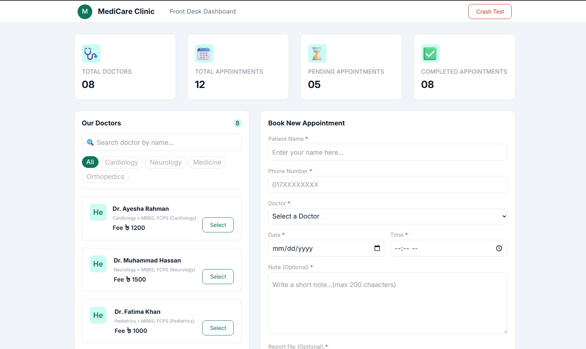
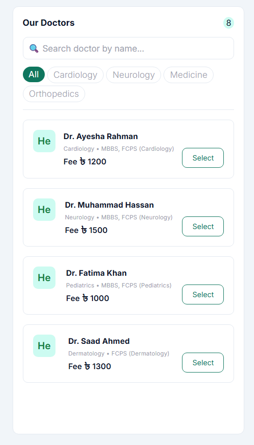
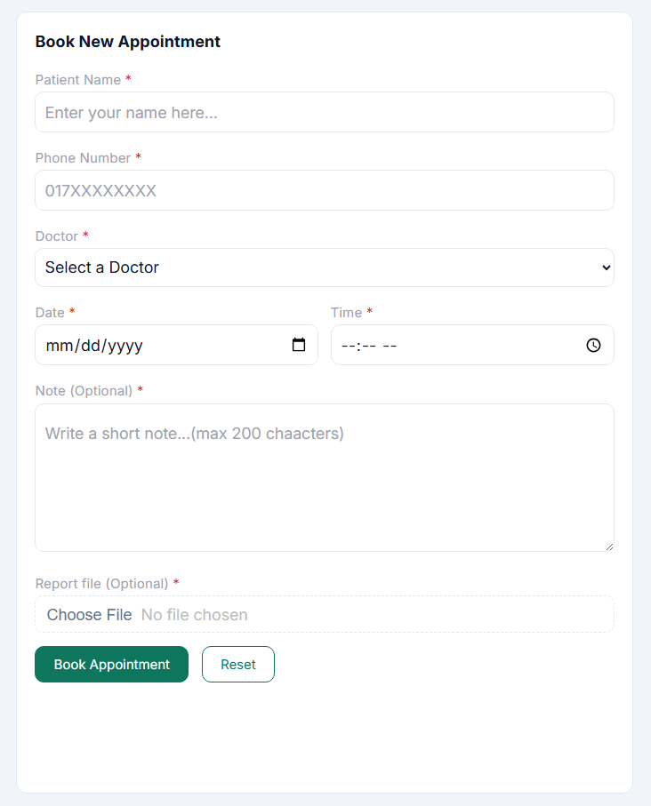
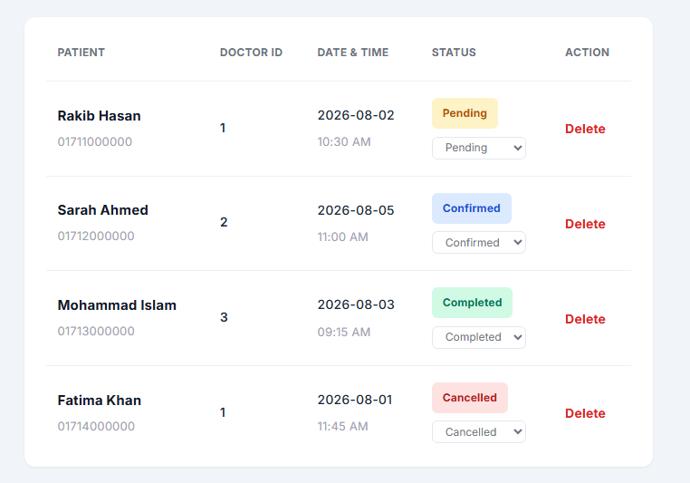
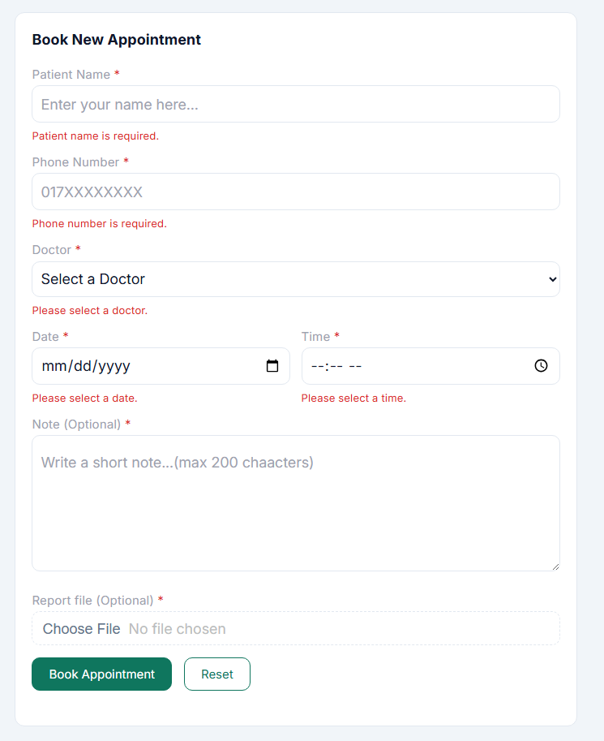

<div align="center">

# 🏥 MediCare — Hospital Appointment Dashboard

A single-page **Hospital Appointment Dashboard** built with **React** and **Vite**, letting a clinic's front desk manage doctors and appointments entirely from hard-coded local state — no backend required.


<br/>


</div>

---

## 📖 Table of Contents

- [About the Project](#-about-the-project)
- [Live Demo](#-live-demo)
- [Screenshots](#-screenshots)
- [Features](#-features)
- [Tech Stack](#-tech-stack)
- [Folder Structure](#-folder-structure)
- [Getting Started](#-getting-started)
- [Available Scripts](#-available-scripts)
- [React Concepts Used](#-react-concepts-used-req-mapping)
- [Prop Drilling](#-prop-drilling)
- [Error Handling](#-error-handling)
- [Known Limitations](#-known-limitations)
- [Author](#-author)
- [License](#-license)

---

## 📌 About the Project

**MediCare Dashboard** is a front-desk web application for a fictional clinic called *MediCare*. From a single screen, a receptionist can:

- View live summary counters (total doctors, total appointments, pending, completed)
- Browse, filter, and search the doctor list
- Select a doctor and book a new appointment through a validated form
- View, update the status of, and delete appointments

The entire app runs on **hard-coded seed data** (`src/data`) and **React state** — there is no backend or database. Refreshing the page resets everything to the original seed data, which is expected behavior for this project.

This project was built as a practical assignment to demonstrate core React fundamentals: component composition, controlled/uncontrolled inputs, lifting state up, prop drilling and its alternatives, and error boundaries.

---

## 🔗 Live Demo

> 🌐 **Live Link:** [your_live_link_here](https://your_live_link_here.netlify.app)  

---

## 🖼️ Screenshots

<div align="center">

### Dashboard Overview


### Doctor Panel — Filter & Search


### Booking Form with Validation


### Appointment List with Status Management


### Error Boundary — Fallback UI


</div>

---

## ✨ Features

### 📊 Dashboard Summary (StatGrid)
- Four live stat cards: **Total Doctors**, **Total Appointments**, **Pending**, **Completed**
- All numbers are **derived from state**, never hard-coded
- Updates instantly on add / status change / delete

### 👨‍⚕️ Doctor Panel
- All doctors rendered dynamically with `.map()`
- Department filter chips generated from the data (no hard-coding)
- Case-insensitive name search, combinable with department filter
- Selecting a doctor highlights its card **and** auto-fills the booking form (lifting state up)
- Doctors with `available: false` show a **"Not available"** badge and a disabled Select button
- Empty filtered results render a reusable `EmptyState` component

### 📝 Booking Form (Controlled + Uncontrolled)
- Controlled fields: Patient Name, Phone Number, Doctor, Date, Time, Note
- **Uncontrolled field:** Report File input, read via `useRef` on submit *(marked with a code comment in the source)*
- Field-level validation with red error text under each invalid field
- Submit button disabled until all required fields are valid
- Validation logic isolated in `src/utils/validators.js`
- Success message shown briefly after a successful submission
- Reset button clears the form fields **and** the selected doctor

### 📋 Appointment List
- Each row shows patient info, doctor + department (resolved via `doctorId`), date & time, status badge, and actions
- Status badge color chosen via a `switch` statement, based on a status token table
- Inline status dropdown updates an appointment's status (Pending / Confirmed / Completed / Cancelled)
- Delete button guarded by `window.confirm()`
- Status filter chips (All / Pending / Confirmed / Completed / Cancelled) with live counts
- Newest appointment always appears first
- Empty list renders `EmptyState` with a helpful message

### 🛡️ Error Handling
- Class-based `ErrorBoundary` wraps both the whole app and the Appointments panel independently
- Friendly Fallback UI with a collapsible error detail and a **Try Again** button
- A **Crash Test** button in the header intentionally throws an error to demonstrate the boundary
- Centralized logger (`src/utils/logger.js`) with `logInfo` / `logWarn` / `logError`, each entry timestamped and labeled
- Global `window.onerror` and `unhandledrejection` handlers registered in `main.jsx`
- `try/catch` used inside the form submit handler with a user-facing error message

### 📱 Fully Responsive
- Layout adapts cleanly across desktop, tablet, and mobile breakpoints using plain CSS (no framework)

---

## 🛠️ Tech Stack

| Category         | Technology                     |
|-------------------|--------------------------------|
| Library            | React (functional components + Hooks) |
| Build Tool         | Vite                           |
| Language           | JavaScript (ES6+)              |
| Styling            | Plain CSS (custom, no framework) |
| Markup             | HTML5                          |
| State Management   | React `useState`, lifted state, prop passing |
| Version Control    | Git & GitHub                   |

---

## 📂 Folder Structure

```
medicare-dashboard/
├── node_modules/
├── public/
├── screenshots/
├── src/
│   ├── assets/
│   ├── components/
│   │   ├── appointments/
│   │   ├── doctors/
│   │   ├── error/
│   │   ├── layout/
│   │   ├── stats/
│   │   └── ui/
│   ├── data/
│   │   ├── appointments.js
│   │   └── doctors.js
│   ├── pages/
│   │   └── FrontDeskDashboard/
│   ├── styles/
│   │   ├── App.css
│   │   └── index.css
│   ├── utils/
│   │   ├── validators.js
│   │   └── logger.js
│   ├── App.jsx
│   └── main.jsx
├── .gitignore
├── eslint.config.js
├── index.html
├── package.json
├── package-lock.json
├── vite.config.js
└── README.md
```

---

## 🚀 Getting Started

### Prerequisites
- [Node.js](https://nodejs.org/) v18 or higher
- npm (comes bundled with Node.js)

### Installation

```bash
# 1. Clone the repository
git clone https://github.com/iamdeveloperrayhan/medicare-dashboard.git

# 2. Move into the project folder
cd medicare-dashboard

# 3. Install dependencies
npm install
```

### Running the App (Development)

```bash
npm run dev
```

The app will start on **http://localhost:5173** (default Vite port) — open it in your browser.

### Building for Production

```bash
npm run build
```

This generates an optimized production build inside the `dist/` folder.

### Previewing the Production Build

```bash
npm run preview
```

---

## 📜 Available Scripts

| Script            | Description                                |
|--------------------|---------------------------------------------|
| `npm run dev`       | Starts the Vite development server          |
| `npm run build`      | Builds the app for production               |
| `npm run preview`    | Serves the production build locally         |
| `npm run lint`       | Runs ESLint across the project              |

---

## 🧩 React Concepts Used (REQ Mapping)

| Requirement | Concept                                   | File(s) / Location                                      |
|--------------|---------------------------------------------|-----------------------------------------------------------|
| REQ-1        | Vite project setup, run & build commands      | `package.json`, `vite.config.js`                            |
| REQ-2        | Folder organization (components/data/utils)   | `src/components/`, `src/data/`, `src/utils/`               |
| REQ-3        | Components, JSX, naming conventions            | All files in `src/components/` and `src/pages/`             |
| REQ-4        | Conditional rendering (ternary, `&&`, switch) | `AppointmentRow.jsx` (status badge switch), `DoctorList.jsx` (empty state ternary) |
| REQ-5        | Looping with `.map()`                          | `DoctorList.jsx`, `AppointmentList.jsx`                     |
| REQ-6        | Passing props to child components               | `AppointmentForm.jsx` → props, `DoctorCard.jsx` → props     |
| REQ-7        | Click & form submit event handling               | `AppointmentForm.jsx` (`handleSubmit`), `AppointmentRow.jsx` (`handleDelete`, `handleStatusChange`) |
| REQ-8        | Component composition & reusability              | `ui/Button.jsx`, `ui/Input.jsx`, `ui/EmptyState.jsx`         |
| REQ-9        | Prop drilling problem + fix                        | See [Prop Drilling](#-prop-drilling) section below            |
| REQ-10       | Controlled vs uncontrolled components             | `AppointmentForm.jsx` — controlled fields vs. `fileInputRef` (uncontrolled) |
| REQ-11       | Error Boundary, Fallback UI                         | `components/error/ErrorBoundary.jsx`, `components/error/FallbackUI.jsx` |
| REQ-12       | Global error handling & logging                     | `main.jsx` (`window.onerror`, `unhandledrejection`), `utils/logger.js` |

---

## 🔀 Prop Drilling

**The Problem:**  
Initially, a value (the `onSelectDoctor` handler / `clinicInfo` object) was passed down through several layers —  
`App → DoctorPanel → DoctorList → DoctorCard` — where the intermediate components (`DoctorPanel`, `DoctorList`) never actually used the value themselves; they only forwarded it further down. This is the classic **prop drilling** problem: it makes intermediate components tightly coupled to data they don't care about, and makes the codebase harder to refactor.

**The Fix:**  
This was resolved using **component composition (children prop)** — instead of passing the raw handler/data down through every layer, the already-built `DoctorCard` elements (with the handler already attached) are constructed higher up and passed down as `children`, so `DoctorPanel` and `DoctorList` simply render `{children}` without needing to know about `onSelectDoctor` at all.

**Why this approach:**  
Composition keeps intermediate components generic and reusable, avoids unnecessary re-renders caused by unrelated prop changes, and doesn't require setting up a Context Provider for what is fundamentally a parent-to-descendant UI composition problem.

> 🌟 **Bonus:** A second implementation using **React Context** is available in [branch/component name] for comparison. Context is a better fit when *many, unrelated* components across the tree need the same value; composition is lighter-weight when the data flow is a single, direct parent → descendant chain.

---

## 🧯 Error Handling

An Error Boundary alone is **not enough** to catch every kind of runtime error in a React app, because it only catches errors thrown during **rendering**, in **lifecycle methods**, and in **constructors** of the component tree below it. It does **not** catch:

- Errors thrown inside **event handlers** (e.g. an `onClick` or `onSubmit` handler)
- Errors from **asynchronous code** (e.g. inside a `setTimeout`, a `fetch`, or a Promise)
- Errors thrown **outside of React's rendering process** entirely (e.g. in a plain utility function called from a non-React context)

To cover these gaps, this project also registers:
- A **`window.onerror`** handler in `main.jsx` to catch uncaught synchronous errors anywhere in the app
- A **`window.addEventListener('unhandledrejection', ...)`** handler to catch unhandled Promise rejections (async errors)
- A `try/catch` block inside the appointment form's submit handler, showing a user-friendly inline error message instead of letting the app crash silently

All three paths — the Error Boundary's `componentDidCatch`, the global `window.onerror`, and `unhandledrejection` — route their errors into a single centralized logger (`src/utils/logger.js`), so every error is timestamped, labeled with context, and consistently logged in one place.

---

## ⚠️ Known Limitations

- No backend/database — all data resets to seed values on page refresh (by design, per assignment scope)
- No authentication or persistent storage
- Report file uploads are read but not actually stored/uploaded anywhere (no backend to receive them)

---

## 👤 Author

**Name:** Developer Rayhan  
**Email:** iamdeveloperrayhan@gmail.com
**GitHub:** [@iamdeveloperrayhan](https://github.com/imdeveloperrayhan)  
**LinkedIn:** [@iamdeveloperrayhan](https://linkedin.com/in/iamdeveloperrayhan)

---

## 📄 License

This project is licensed under the **MIT License** — feel free to use it for learning purposes.

```
MIT License

Copyright (c) 2026 Developer Rayhan

Permission is hereby granted, free of charge, to any person obtaining a copy
of this software and associated documentation files (the "Software"), to deal
in the Software without restriction, including without limitation the rights
to use, copy, modify, merge, publish, distribute, sublicense, and/or sell
copies of the Software, subject to the following conditions:

The above copyright notice and this permission notice shall be included in all
copies or substantial portions of the Software.
```

---

<div align="center">

Made with ❤️ using React & Vite — MediCare Clinic Dashboard Assignment

</div>